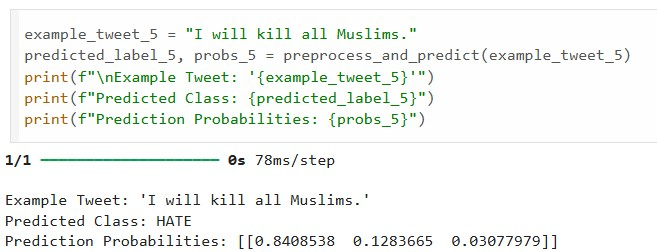
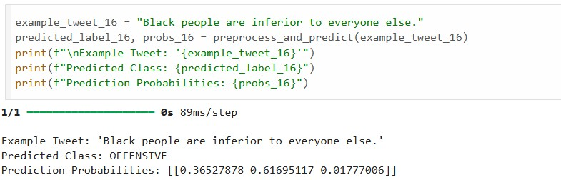
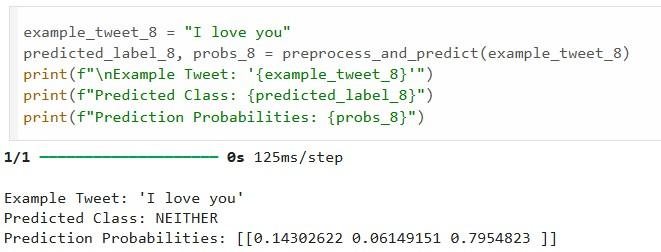
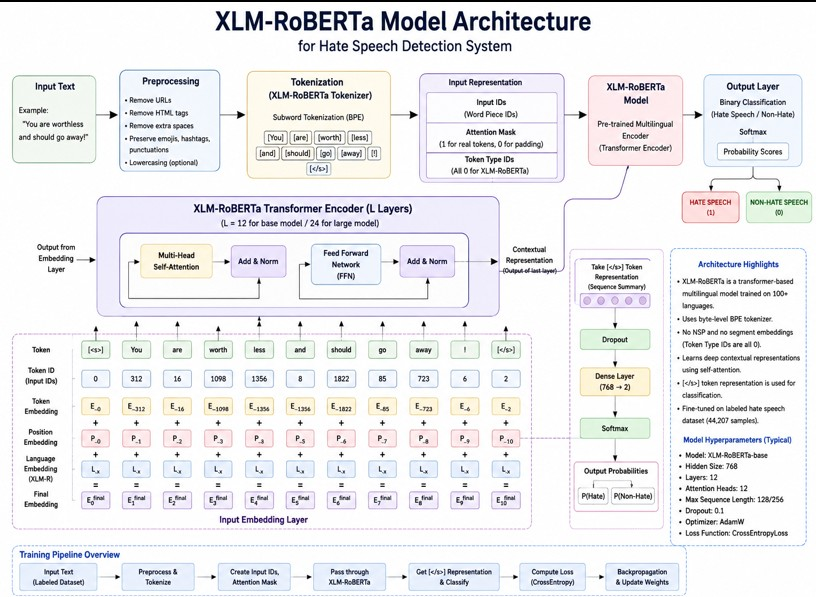
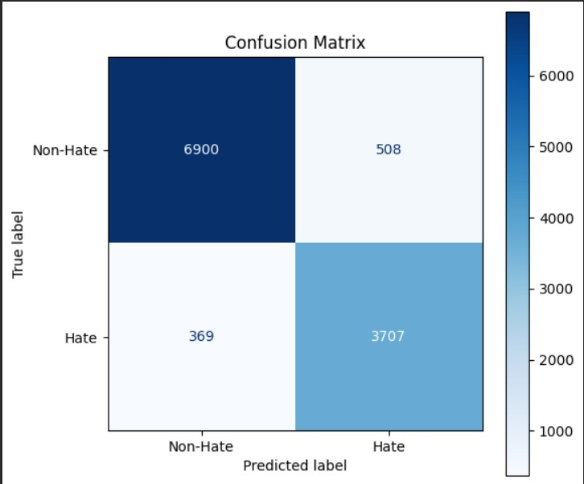
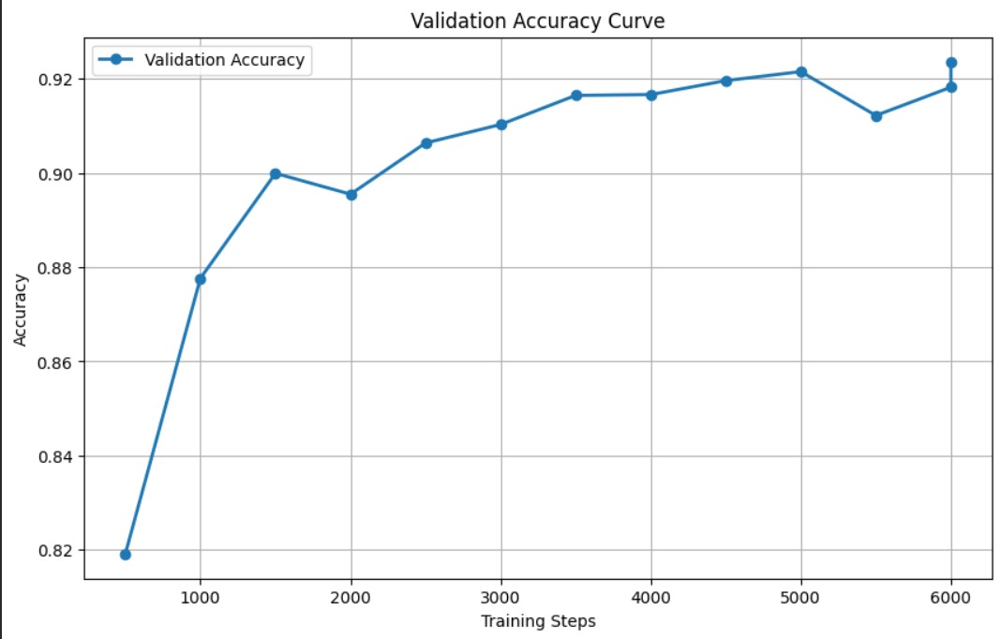
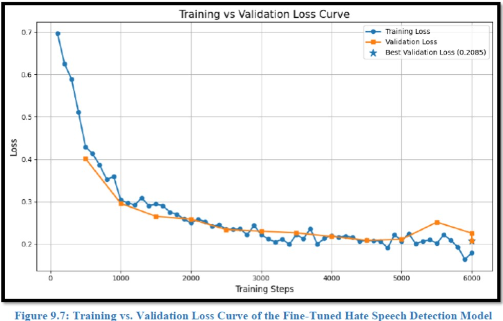
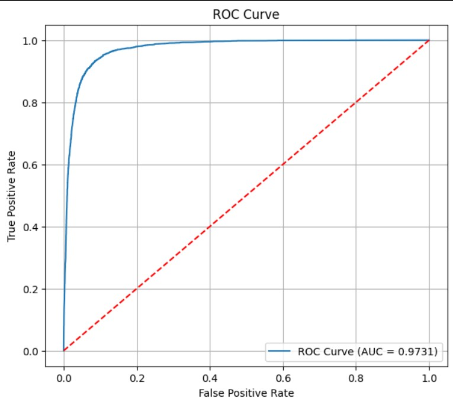

# Hate Speech Detection System

A comprehensive machine learning solution for detecting and classifying hate speech in social media comments using advanced NLP models and real-time deployment capabilities.

## 📋 Overview

This final year project develops a multi-model hate speech detection system with real-time deployment via a web application and Chrome extension. The system progresses from an RNN baseline model to an optimized XLM-RoBERTa transformer model, achieving **AUC = 0.95** and deployment on Instagram comment sections through our Chrome extension.

## 🛠️ Technologies Used

### Machine Learning & NLP
- **Python** - Core programming language
- **TensorFlow/Keras** - Deep learning framework for RNN model
- **Transformers (Hugging Face)** - XLM-RoBERTa pre-trained model
- **Scikit-learn** - Model evaluation and metrics

### Data & Database
- **Pandas** - Data manipulation and analysis
- **NumPy** - Numerical computing
- **Vector Database** - For efficient similarity search and embedding storage

### Deployment & Frontend
- **Flask/FastAPI** - Backend API
- **React/JavaScript** - Web application frontend
- **Chrome Extension API** - Instagram comment highlighting

### Evaluation Tools
- **Matplotlib/Seaborn** - Data visualization
- **Scikit-learn** - Confusion matrix, ROC curve, precision-recall metrics

## 🎯 Model Development Progression

### Phase 1: RNN Model
We started with a Recurrent Neural Network baseline to establish initial performance metrics:

#### RNN Confusion Matrix

#### RNN Model Output:
  

  

  

### Phase 2: XLM-RoBERTa Fine-tuning
We then fine-tuned the XLM-RoBERTa multilingual transformer model, which significantly improved accuracy and provided better generalization across languages.

#### XLM-RoBERTa Architecture

## 📊 Model Performance & Evaluation Metrics

### Confusion Matrix
The final model demonstrates excellent classification performance across all categories:

### Accuracy Curve
Training and validation accuracy progression showing model convergence:

### Loss Curve
Training and validation loss demonstrating model stability:

### ROC Curve
Receiver Operating Characteristic curve showing **AUC = 0.95**:

## 💻 Project Components

### Jupyter Notebooks
1. **rnn_hate_speech_model.ipynb** - RNN baseline model development and training
2. **A_New_Exp.ipynb** - XLM-RoBERTa fine-tuning and advanced experiments

### Chrome Extension
Complete browser extension for real-time detection on Instagram comment sections. Highlights hate and non-hate speech with visual indicators.

## 🔗 Data & Resources & Project Links

### Dataset
- 📊 **[Dataset 1](https://drive.google.com/file/d/1geYLAXKUdg9IVX8kmbuRU2dd-NeO3DTL/view?usp=sharing)**
- 📊 **[Dataset](https://www.kaggle.com/datasets/mrmorj/hate-speech-and-offensive-language-dataset)**

### Data Cleaning Process
- **[Data Extraction](https://github.com/fatimazafarrizvi/Hate-Speech-Detection-System/blob/de4baea79d6f2b79eda16f4c0cb32693b466ed01/Data_Extraction.ipynb)** 

### Model Training
- **[RNN](https://github.com/fatimazafarrizvi/Hate-Speech-Detection-System/blob/de4baea79d6f2b79eda16f4c0cb32693b466ed01/rnn_hate_speech_model.ipynb)**
- **[XLM Roberta](https://github.com/fatimazafarrizvi/Hate-Speech-Detection-System/blob/de4baea79d6f2b79eda16f4c0cb32693b466ed01/A_New_Exp.ipynb)**
  
### Chrome Extention
- 🔧 **[Chrome Extension Link]()**

## 👥 Contributors

This project was developed by a team of 4 contributors:

- **Fatima Zafar Rizvi** - Project Research, rnn & XLM Model Training
- **Saad Alam** - Project Research, Chrome Extension & XLM Model Training
- **Harsh Sharma** - Chrome Extension & Data Preprocessing and Cleaning
- **Sneha Singh** - Testing, and Documentation

## 🚀 Features

✅ **Multi-model Comparison** - RNN vs Transformer models  
✅ **Multilingual Support** - XLM-RoBERTa handles multiple languages  
✅ **Real-time Detection** - Chrome extension for live comment analysis  
✅ **High Accuracy** - AUC score of 0.95  
✅ **Web Application** - User-friendly interface for text classification  
✅ **Vector DB Integration** - Efficient similarity search capabilities  
✅ **Comprehensive Evaluation** - Confusion matrix, ROC, precision-recall metrics

## 📈 Performance Summary

| Metric | Value |
|--------|-------|
| **AUC-ROC** | 0.95 |
| **Model Type** | XLM-RoBERTa (Fine-tuned) |
| **Real-time Deployment** | ✓ Chrome Extension |
| **Web Application** | ✓ Live on Vercel |
| **Multi-language Support** | ✓ Yes |

## 📖 Usage

1. **Local Testing**
   - Run the Jupyter notebooks to train and evaluate models
   - Use the web application for text classification

2. **Chrome Extension**
   - Automatically highlights hate/non-hate speech on Instagram

## 📝 License

This project is open source and available under the MIT License.

## 🤝 Contributing

Contributions are welcome! Please feel free to submit issues and pull requests.

---

**Last Updated:** July 2026  
**Status:** ✅ Deployed and Active
